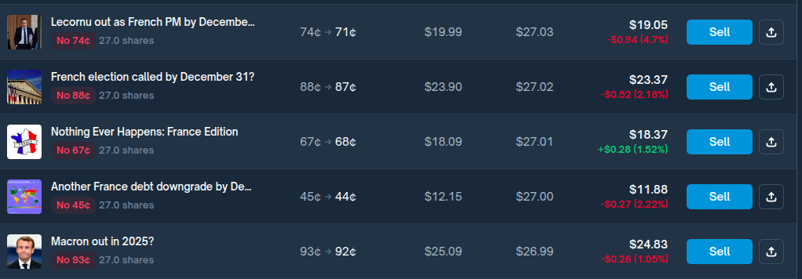

## Dani trades

### 2025-09-26

**Nothing ever happens France**: free 9% when events are distinct/we are fast enough to sell when the first one happens. (EVERYTHING BY DEC 31)

-O1: France debt downgrade
-O2: Macron out
-O3: Lecornou out
-O4: French election

{'n': 4,
 'outcome_names': ['O1', 'O2', 'O3', 'O4'],
 'yes_prices': [0.55, 0.26, 0.12, 0.07],
 'no_prices': [0.44999999999999996, 0.74, 0.88, 0.9299999999999999],
 'parlay_yes_price': 0.34,
 'shares_no_each': 27.3224043715847,
 'shares_no_by_outcome': {'O1': 27.3224043715847,
  'O2': 27.3224043715847,
  'O3': 27.3224043715847,
  'O4': 27.3224043715847},
 'share_parlay_yes': 0.0,
 'share_parlay_no': 27.3224043715847,
 'spend_no_by_outcome': {'O1': 12.295081967213113,
  'O2': 20.218579234972676,
  'O3': 24.043715846994537,
  'O4': 25.409836065573767},
 'spend_parlay_yes': 0.0,
 'spend_parlay_no': 18.0327868852459,
 'sum_no_prices': 3.0,
 'arbitrage_margin_per_share': 0.33999999999999986,
 'arbitrage': True,
 'total_spend': 99.99999999999999,
 'payout': 109.2896174863388,
 'guaranteed_payout': 109.2896174863388,
 'guaranteed_profit': 9.289617486338813,
 'roi': 0.09289617486338814,
 'state_payouts': {'O1': 109.2896174863388,
  'O2': 109.2896174863388,
  'O3': 109.2896174863388,
  'O4': 109.2896174863388,
  'none_of_these': 109.2896174863388},
 'construction': 'long_no_parlay',
 'notes': 'Long-only construction buys No on each candidate and No on the parlay at price (1 - e), giving equal payout N\*s. Alternatively, shorting Yes(E) by s (if available) yields equal payout (N-1)\*s.'}

  